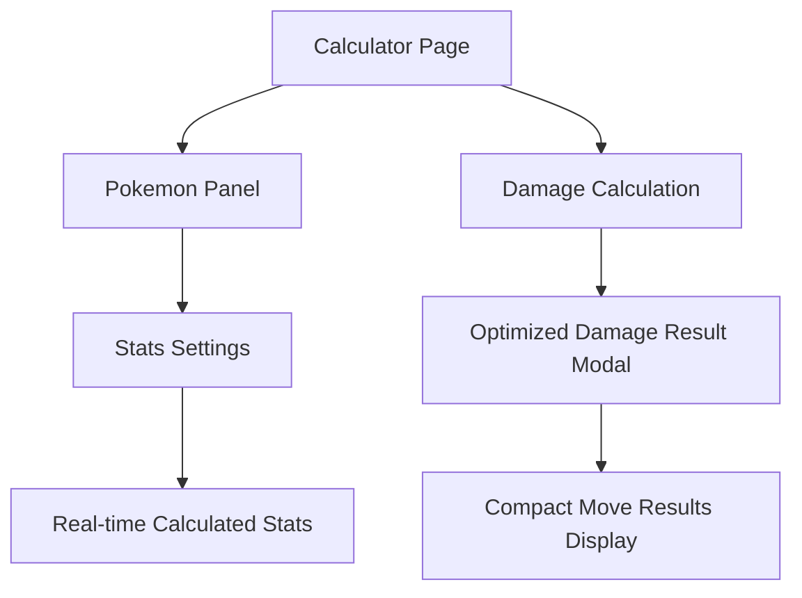

# 宝可梦伤害计算器界面优化产品需求文档

## 1. Product Overview

优化宝可梦伤害计算器的用户界面，提升伤害结果显示的可读性和能力值设置的实时反馈体验。
- 解决当前伤害结果弹窗中招式数据需要滚动查看的用户体验问题，提供更直观的数据展示方式。
- 增加实时计算能力值显示功能，让用户在调整个体值和努力值时能够立即看到最终能力值的变化。

## 2. Core Features

### 2.1 Feature Module

我们的计算器优化需求包含以下主要功能模块：
1. **伤害结果弹窗优化**：重新设计布局，减少滚动需求，提升数据可见性
2. **实时能力值计算显示**：在能力值设置区域添加计算后的最终能力值展示
3. **响应式布局改进**：确保在不同屏幕尺寸下都有良好的显示效果

### 2.2 Page Details

| Page Name | Module Name | Feature description |
|-----------|-------------|---------------------|
| Calculator Page | DamageResultModal | 优化弹窗布局，采用更紧凑的卡片设计，减少垂直滚动需求。调整招式结果展示方式，使用网格布局或折叠面板 |
| Calculator Page | PokemonPanel | 在能力值设置区域下方添加"计算后能力值"显示区域，实时展示HP、攻击、防御、特攻、特防、速度的最终数值 |
| Calculator Page | Real-time Calculation | 当用户修改个体值或努力值输入框时，触发实时计算并更新显示的最终能力值 |

## 3. Core Process

**用户操作流程：**
1. 用户进入计算器页面，设置宝可梦基础信息
2. 用户调整个体值和努力值 → 系统实时计算并显示最终能力值
3. 用户点击计算伤害按钮 → 系统打开优化后的伤害结果弹窗
4. 用户在弹窗中查看所有招式的伤害数据，无需滚动即可看到完整信息

## 4. User Interface Design

### 4.1 Design Style

- **主色调**：保持现有的橙色主题 (#f97316, #ea580c)
- **辅助色**：蓝色 (#3b82f6)、红色 (#ef4444)、绿色 (#10b981)
- **布局风格**：卡片式设计，圆角边框 (rounded-xl)
- **字体**：保持现有的字体层级和大小
- **动画效果**：平滑的过渡动画，实时数值变化时的视觉反馈

### 4.2 Page Design Overview

| Page Name | Module Name | UI Elements |
|-----------|-------------|-------------|
| Calculator Page | Calculated Stats Display | 6个能力值卡片，每个显示图标、名称和计算后数值。使用网格布局 (grid-cols-3)，配色与原有能力值设置保持一致 |
| Calculator Page | Optimized Damage Modal | 采用更紧凑的布局，招式结果使用2列网格显示，减少垂直高度。弹窗最大高度调整为85vh，内容区域使用flex布局 |
| Calculator Page | Move Result Cards | 简化招式卡片设计，关键信息前置显示，次要信息可折叠。使用渐变背景和阴影效果 |

### 4.3 Responsiveness

桌面优先设计，在移动端自适应为单列布局。弹窗在小屏幕设备上占据更多屏幕空间，确保内容可读性。