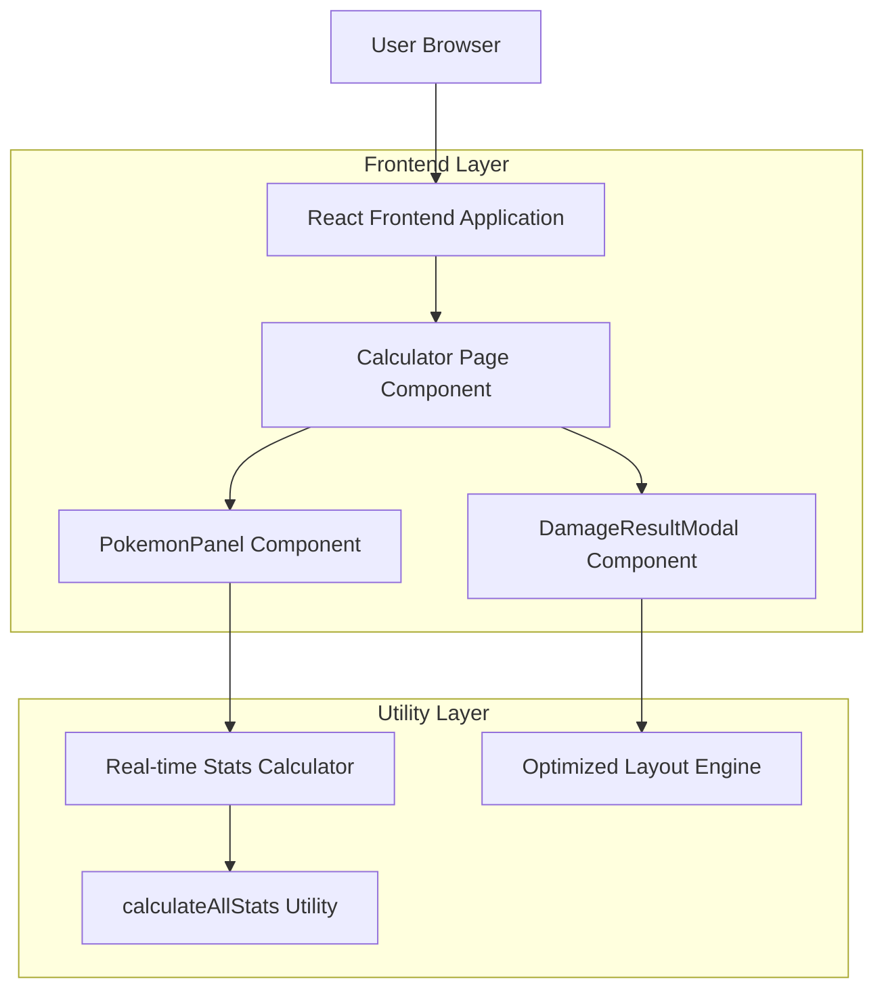

# 宝可梦伤害计算器优化技术架构文档

## 1. Architecture design



## 2. Technology Description

- Frontend: React@18 + TypeScript + Tailwind CSS@3 + Vite
- State Management: React useState + useCallback hooks
- Calculation Engine: 现有的 pokemonStatsCalculator.ts 工具函数
- UI Components: Lucide React icons + 自定义组件

## 3. Route definitions

| Route | Purpose |
|-------|---------|
| /calculator | 宝可梦伤害计算器主页面，包含优化后的界面组件 |

## 4. Component Architecture

### 4.1 核心组件结构

**PokemonPanel 组件增强**
```typescript
interface CalculatedStatsDisplayProps {
  baseStats: PokemonStats;
  ivs: PokemonIVs;
  evs: PokemonEVs;
  level: number;
  nature: string;
}

// 新增实时计算能力值显示组件
const CalculatedStatsDisplay: React.FC<CalculatedStatsDisplayProps>
```

**DamageResultModal 组件优化**
```typescript
interface OptimizedMoveResultCardProps {
  moveResult: SingleMoveResult;
  isCompact?: boolean;
}

// 优化后的招式结果卡片组件
const OptimizedMoveResultCard: React.FC<OptimizedMoveResultCardProps>
```

### 4.2 状态管理

**实时计算状态**
```typescript
// 在 PokemonPanel 中添加计算状态
const [calculatedStats, setCalculatedStats] = useState<PokemonStats | null>(null);

// 监听 IV/EV 变化的 useEffect
useEffect(() => {
  const newStats = calculateAllStats(baseStats, ivs, evs, level, nature);
  setCalculatedStats(newStats);
}, [baseStats, ivs, evs, level, nature]);
```

### 4.3 布局优化策略

**弹窗布局改进**
- 使用 CSS Grid 替代垂直堆叠布局
- 招式结果采用 2列网格显示 (lg:grid-cols-2)
- 弹窗最大高度调整为 85vh
- 内容区域使用 flex 布局优化空间利用

**能力值显示布局**
- 在现有能力值设置下方添加计算结果区域
- 使用 3列网格布局展示6个能力值
- 每个能力值卡片包含图标、名称和数值

## 5. 实现细节

### 5.1 计算逻辑集成

使用现有的 `calculateAllStats` 函数：
```typescript
import { calculateAllStats } from '@/utils/pokemonStatsCalculator';

// 实时计算最终能力值
const calculatedStats = calculateAllStats(
  pokemon.baseStats || defaultBaseStats,
  pokemon.ivs,
  pokemon.evs,
  pokemon.level,
  pokemon.nature
);
```

### 5.2 UI 组件优化

**CalculatedStatsDisplay 组件**
```typescript
const CalculatedStatsDisplay = ({ baseStats, ivs, evs, level, nature }) => {
  const calculatedStats = useMemo(() => 
    calculateAllStats(baseStats, ivs, evs, level, nature),
    [baseStats, ivs, evs, level, nature]
  );

  return (
    <div className="mt-4 p-4 bg-gray-50 rounded-lg">
      <h4 className="font-medium text-gray-700 mb-3">计算后能力值</h4>
      <div className="grid grid-cols-3 gap-3">
        {/* 6个能力值卡片 */}
      </div>
    </div>
  );
};
```

**优化后的 DamageResultModal**
```typescript
// 调整弹窗内容布局
<div className="p-6 overflow-y-auto max-h-[85vh]">
  <div className="grid grid-cols-1 lg:grid-cols-2 gap-6">
    {/* 使用优化后的 PokemonDamageSection */}
  </div>
</div>
```

### 5.3 性能优化

- 使用 `useMemo` 缓存计算结果，避免不必要的重复计算
- 使用 `useCallback` 优化事件处理函数
- 实现防抖机制，避免用户快速输入时的频繁计算

## 6. 文件修改清单

### 6.1 需要修改的文件

1. **src/components/calculator/PokemonPanel.tsx**
   - 添加 CalculatedStatsDisplay 组件
   - 集成实时计算逻辑

2. **src/components/calculator/DamageResultModal.tsx**
   - 优化 PokemonDamageSection 布局
   - 重新设计 MoveResultCard 组件
   - 调整弹窗尺寸和滚动行为

3. **src/utils/pokemonStatsCalculator.ts**
   - 确保计算函数的稳定性和性能

### 6.2 新增组件

1. **CalculatedStatsDisplay.tsx** - 实时能力值显示组件
2. **OptimizedMoveResultCard.tsx** - 优化后的招式结果卡片

## 7. 测试策略

### 7.1 功能测试
- 验证实时计算的准确性
- 测试不同屏幕尺寸下的布局表现
- 确保弹窗优化后的可用性

### 7.2 性能测试
- 监控计算函数的执行时间
- 验证内存使用情况
- 测试大量数据下的渲染性能